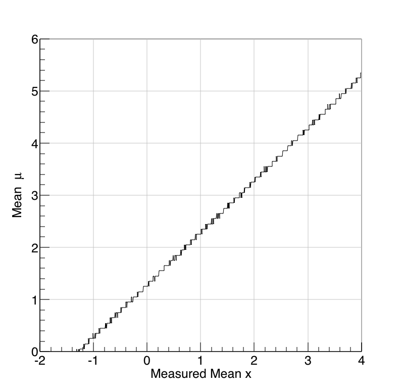
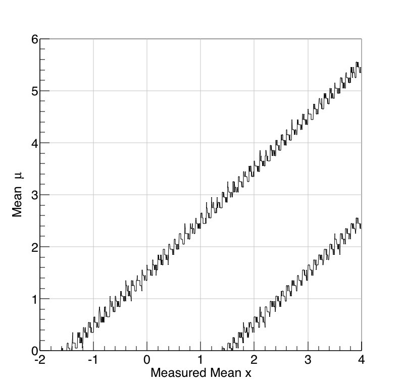

# Fig.2 and Fig.3

Though Fig.2 and Fig.3 can be drawn analytically, I wil try to draw these by rolling the dices.  Running the script [`scripts/fig2and3.cc`](../scripts/fig2and3.cc) will creates follwing [`fig2.png`](../fig/fig2.png) and [`fig3.png`](../fig/fig3.png). These hand-maid figure don't resemble original figures on the paper because of the effect of binning. If we had infinite number of bins and we rolled the dice infinite number of time, we would have same figures. Instead of doing that, of course, we can calculate the limit by known Gaussian.

```shell
cd scripts
root fig2and3.cc+  # or slow alternative: root fig2and3.cc
```



